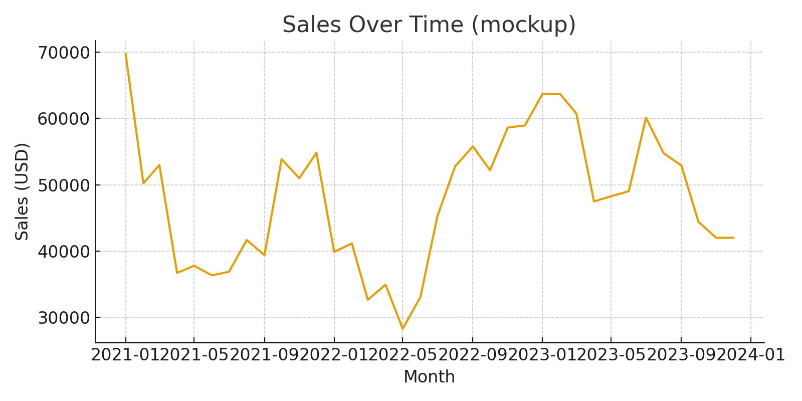
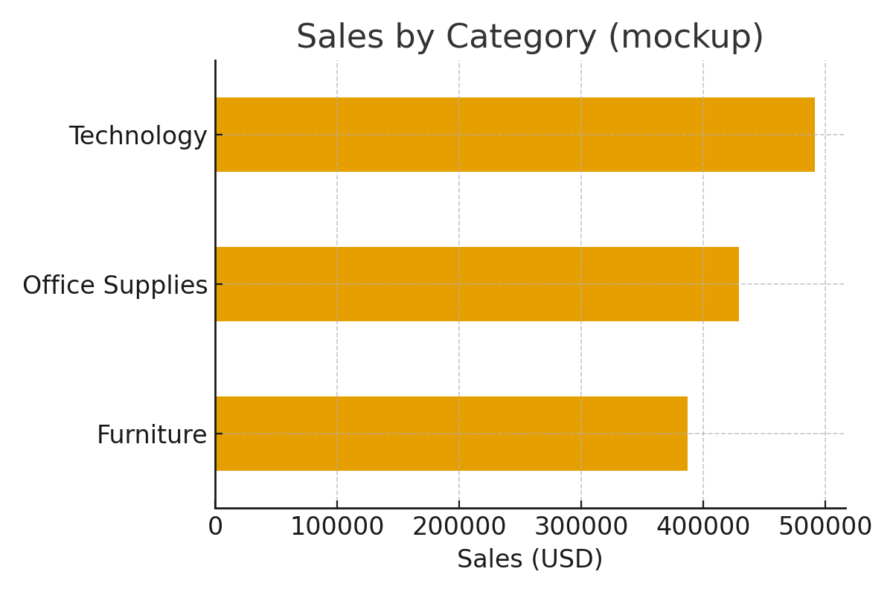
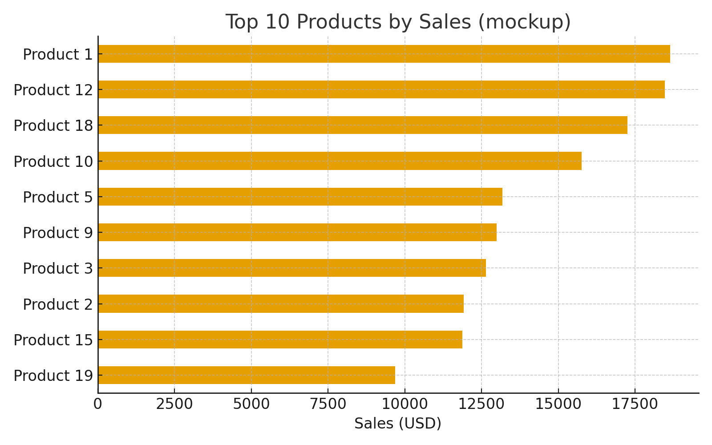
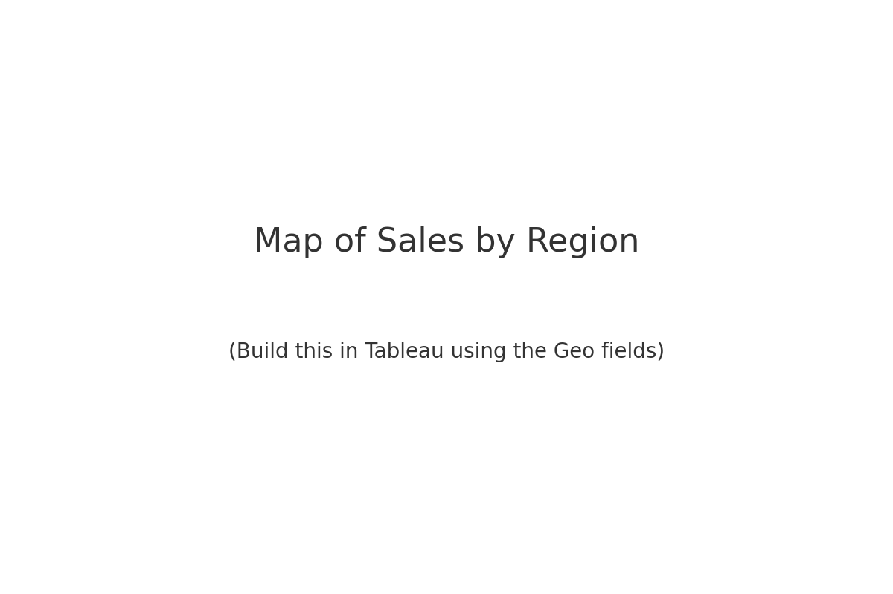

# Retail Sales Dashboard (Tableau Public)

A polished, portfolio-ready dashboard project using **Tableau Public** (Mac-friendly) and the popular **Superstore** dataset.

## 🎯 What this shows
- Sales trend over time
- Sales by product category
- Top 10 products
- A geographic view (map) of sales by region/state

## 🧰 Tech
- **Tableau Public** (free, runs on Mac)
- **Python (optional)** for quick data checks and generating mockups
- Dataset: Superstore (link below)

## 📦 Repo structure
```
retail-sales-dashboard/
├─ README.md
├─ .gitignore
├─ LICENSE
├─ data/
│  └─ README.md
├─ docs/
│  └─ mockups/
│     ├─ sales_over_time.png
│     ├─ sales_by_category.png
│     ├─ top_10_products.png
│     └─ map_placeholder.png
├─ tableau/
│  ├─ build_instructions.md
│  └─ calculated_fields.md
└─ scripts/
   └─ prepare_data.py
```

## 🔎 Screenshots (mockups)
> These are **mockups** to show the final look/feel. Your real visuals will update once you build the dashboard in Tableau with the dataset.






## 🚀 Quickstart (Tableau Public)
1. **Install** Tableau Public (Mac): https://public.tableau.com/en-us/s/download  
2. **Download the dataset** (see `data/README.md`).  
3. **Follow the step-by-step guide** in `tableau/build_instructions.md` to build:
   - Sales over time (line)
   - Sales by category (bar)
   - Top 10 products (table/bar)
   - Sales by state/region (map)
4. **Publish** your finished dashboard to Tableau Public and add the link here.

## 📈 KPIs & Questions
- Total Sales, Sales by Category, Sales by Region
- Trend of sales month-over-month
- Which products/categories generate the most revenue?
- Where are the strongest/weakest regions?

## 📝 Talking points for interviews
- **Why these visuals?** Line chart for temporal trend, bar charts for categorical comparison, table for ranked products, map for spatial insight.
- **Design choices:** Consistent fonts, minimal clutter, sorted bars, clear titles, and a guided layout (trend → categories → products → geography).
- **Interactivity:** Filters for date range, category, and region; hover tooltips for quick metrics.
- **Business value:** Quickly spot seasonality, high-performing categories, and regional opportunities/risks.

## 🔧 Next steps you can add later
- Profit ratio & YoY growth
- Customer segmentation
- Forecasting line (Tableau analytics pane)

---

**Author:** Your Name  
**License:** MIT
